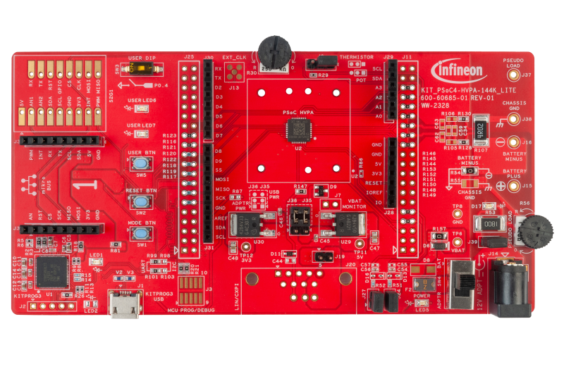

# KIT_PSOC4-HVPA-144K_LITE BSP

## Overview

PSOC™ 4 High Voltage Precision Analog (HVPA)-144K is a fully integrated programmable embedded system for  lead acid battery monitoring and management. The system features an Arm® Cortex® M0+ processor and  programmable and reconfigurable analog and digital blocks.

To use code from the BSP, simply include a reference to `cybsp.h`.

## Features

### Kit Features:

* On-board Programmer and Debugger
* Two precision Delta-Sigma ADCs (16-20+ bits) with automatic gain current channel and HV input divider voltage channel
* Digital peripherals, such as PWMs
* Serial communication interfaces along with a LIN interface with integrated PHY
* High-voltage subsystem to operate directly off the 12-V car battery

### Kit Contents:

* KIT_PSOC4-HVPA-144K_LITE Board
* USB Type-A to Micro-B cable
* Quick Start Guide

### Low-level Driver References:

* See 
[Peripheral driver library (PDL) library](https://infineon.github.io/mtb-pdl-cat2/pdl_api_reference_manual/html/index.html)

## BSP Configuration

The BSP has a few hooks that allow its behavior to be configured. Some of these items are enabled by default while others must be explicitly enabled. Items enabled by default are specified in the bsp.mk file. The items that are enabled can be changed by creating a custom BSP or by editing the application makefile.

Components:
* Device specific category reference (e.g.: CAT1) - This component, enabled by default, pulls in any device specific code for this board.

Defines:
* CYBSP_WIFI_CAPABLE - This define, disabled by default, causes the BSP to initialize the interface to an onboard wireless chip if it has one.
* CY_USING_HAL - This define, enabled by default in some BSPs, specifies that the HAL is intended to be used by the application. This will cause the BSP to include the applicable header file and to initialize the system level drivers.  Newer BSPs pull in the v3.x HAL, which enables itself via its own makefile, so CY_USING_HAL is not present.
* CYBSP_CUSTOM_SYSCLK_PM_CALLBACK - This define, disabled by default, causes the BSP to skip registering its default SysClk Power Management callback, if any, and instead to invoke the application-defined function `cybsp_register_custom_sysclk_pm_callback` to register an application-specific callback.

### Clock Configuration

| Clock    | Source    | Output Frequency |
|----------|-----------|------------------|
| CLK_HF   | CLK_IMO   | 24 MHz           |

### Power Configuration

* System Idle Power Mode: Deep Sleep
* VDDA Voltage: 5000 mV
* VDDD Voltage: 3300 mV

See the [BSP Setttings][settings] for additional board specific configuration settings.

## API Reference Manual

The KIT_PSOC4-HVPA-144K_LITE Board Support Package provides a set of APIs to configure, initialize and use the board resources.

See the [BSP API Reference Manual][api] for the complete list of the provided interfaces.

## More information
* [KIT_PSOC4-HVPA-144K_LITE BSP API Reference Manual][api]
* [KIT_PSOC4-HVPA-144K_LITE Documentation](https://www.infineon.com/psochvpalitekit)
* [Cypress Semiconductor, an Infineon Technologies Company](http://www.cypress.com)
* [Infineon GitHub](https://github.com/infineon)
* [ModusToolbox™](https://www.cypress.com/products/modustoolbox-software-environment)

[api]: https://infineon.github.io/TARGET_KIT_PSOC4-HVPA-144K_LITE/html/modules.html
[settings]: https://infineon.github.io/TARGET_KIT_PSOC4-HVPA-144K_LITE/html/md_bsp_settings.html

---
© Cypress Semiconductor Corporation (an Infineon company) or an affiliate of Cypress Semiconductor Corporation, 2019-2025.